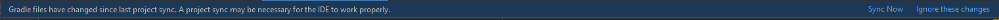

# Installation

## 1. Installing from FTCLib

## build.gradle

The only thing you need to change from FTCLib is the dependency in `build.gradle`


```groovy
dependencies {
    // implementation "org.ftclib.ftclib:core:2.1.1" remove FTCLib core
    // FTCLib's vision is no longer supported in SolversLib
    implementation "org.solverslib:core:0.2.3" // add SolversLib core
```


## OR

Change to this dependency block if you are using pedroPathing


```groovy
dependencies {
    // implementation "org.ftclib.ftclib:core:2.1.1" remove FTCLib core
    // FTCLib's vision is no longer supported in SolversLib
    implementation "org.solverslib:core:0.2.3" // core
    implementation "org.pedroPathing:core:0.2.3" // pedroPathing
}
```


Please note that you should not and cannot have both FTCLib and SolversLib installed at the same time

#### Changing Imports:

Lastly, follow the steps in the [Changing Imports](installation.md#changing-imports-1) section and then Gradle Sync

## 2. Installing from Scratch

## build.common.gradle

First, you need to add the `mavenCentral` library repository to your `build.gradle` file at the project root:


```groovy
    repositories {
        mavenCentral()
    }
```


Next, `minSdkVersion` to `24` and `multiDexEnabled` to `true`:


```groovy
defaultConfig {
    applicationId 'com.qualcomm.ftcrobotcontroller'
    minSdkVersion 24
    targetSdkVersion 28
    multiDexEnabled true
```


Next, change `JavaVersion` to `8` :


```groovy
compileOptions {
    sourceCompatibility JavaVersion.VERSION_1_8
    targetCompatibility JavaVersion.VERSION_1_8
}
```


## build.gradle (TeamCode)

Add this dependency block for the base library:


```groovy
dependencies {
    implementation "org.solverslib:core:0.2.3" // core
```


## OR

Add this dependency block if you are using pedroPathing


```groovy
dependencies {
    implementation "org.solverslib:core:0.2.3" // core
    implementation "org.pedroPathing:core:0.2.3" // pedroPathing
}
```



**Warning:** If you choose to use the Pedro Pathing module, you still need to [install Pedo Pathing](https://pedropathing.com/prerequisites.html#project-setup) in order to use it.


## Changing Imports:

Because the package names will be different, you can either manually replace all instances of `com.arcrobotics.ftclib` with `com.seattlesolvers.solverslib` , or use a command in a terminal to replace them all at once for you. Please make sure you either open a terminal into your Android Studio project or use the built-in Android Studio terminal to run the commands below.

FTCLib Imports to SolversLib Imports (MacOS/Linux):

```bash
find . -type f -name "*.java" -exec sed -i '' 's/com.arcrobotics.ftclib/com.seattlesolvers.solverslib/g' {} +
```

SolversLib Imports to FTCLib Imports (MacOS/Linux):

```bash
find . -type f -name "*.java" -exec sed -i '' 's/com.seattlesolvers.solverslib/com.arcrobotics.ftclib/g' {} +
```

FTCLib Imports to SolversLib Imports  (Windows):

```powershell
Get-ChildItem -Recurse -Filter *.java | ForEach-Object { (Get-Content $.FullName) -replace 'com.arcrobotics.ftclib', 'com.seattlesolvers.solverslib' | Set-Content $.FullName }
```

SolversLib Imports to FTCLib Imports (Windows):

```powershell
Get-ChildItem -Recurse -Filter *.java | ForEach-Object { (Get-Content $.FullName) -replace 'com.seattlesolvers.solverslib', 'com.arcrobotics.ftclib' | Set-Content $.FullName }
```

### Sync Gradle and Finished!


